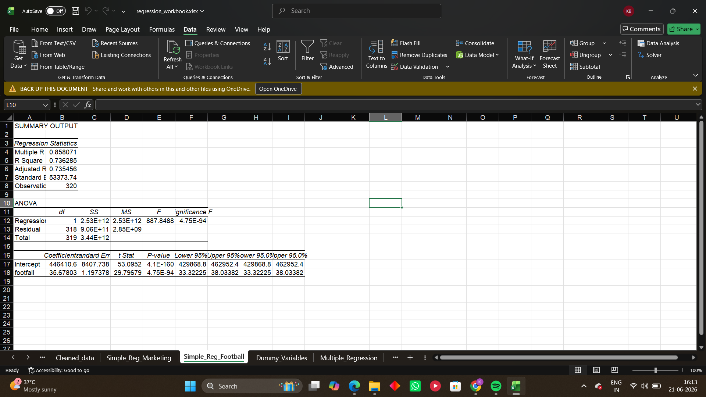
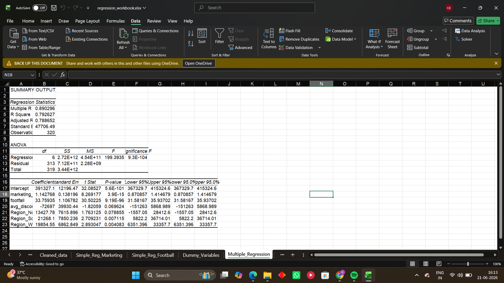
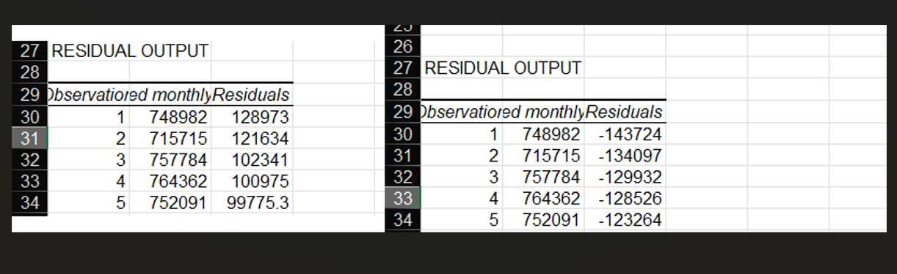
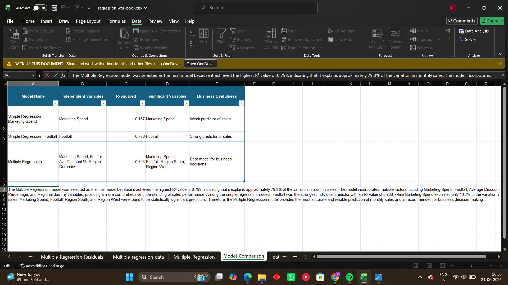

# Regression-Based Business Insights and Model Interpretation

## Project Overview

This project applies regression analysis techniques to identify the factors influencing monthly sales across retail stores. The analysis includes data cleaning, dummy variable creation, simple regression, multiple regression, residual analysis, and model comparison.

The objective is to determine which business variables significantly affect monthly sales and to develop a reliable predictive model for business decision-making.

---

# Dataset Description

The dataset contains retail store performance information with variables related to sales, marketing, customer traffic, inventory, discounts, and regional characteristics.

### Key Variables

* Monthly Sales (Dependent Variable)
* Marketing Spend
* Footfall
* Average Discount Percentage
* Region
* Store Type
* Customer Rating
* Inventory Availability
* Staff Count
* Competitor Distance

---

# Data Cleaning

Before performing regression analysis, the dataset was cleaned and validated.

### Missing Values Handled

| Variable               | Missing Values | Treatment       |
| ---------------------- | -------------- | --------------- |
| customer_rating        | 8              | Mean Imputation |
| competitor_distance_km | 6              | Mean Imputation |

### Data Validation

* No duplicate records were found.
* No invalid values were detected.
* Dataset prepared for regression analysis.

---

# Dummy Variable Creation

Categorical variables cannot be directly used in regression analysis.

Dummy variables were created for:

### Region

* Region_North
* Region_South
* Region_West

Reference Category:

* East

### Store Type

* Store_Airport
* Store_HighStreet
* Store_Mall

Reference Category:

* Residential

---

# Simple Regression Analysis

## Objective

To evaluate the individual impact of a single predictor variable on Monthly Sales.

### Model 1: Marketing Spend vs Monthly Sales

Results:

* R² = 0.167
* Positive coefficient
* Statistically significant relationship

Interpretation:

Marketing Spend positively influences Monthly Sales. However, the model explains only 16.7% of the variation in sales and therefore has limited predictive power when used alone.

### Model 2: Footfall vs Monthly Sales

Results:

* R² = 0.736
* Positive coefficient
* Highly significant relationship

Interpretation:

Footfall is a strong predictor of Monthly Sales and explains approximately 73.6% of the variation in sales.

### Screenshot



---

# Multiple Regression Analysis

## Objective

To evaluate the combined impact of multiple business variables on Monthly Sales.

### Variables Used

Dependent Variable:

* Monthly Sales

Independent Variables:

* Marketing Spend
* Footfall
* Average Discount Percentage
* Region_North
* Region_South
* Region_West

### Results

| Metric         | Value    |
| -------------- | -------- |
| R²             | 0.793    |
| Adjusted R²    | 0.789    |
| F Statistic    | 199.39   |
| Significance F | 9.3E-104 |

### Significant Variables

* Marketing Spend
* Footfall
* Region_South
* Region_West

### Interpretation

The Multiple Regression model explains approximately 79.3% of the variation in Monthly Sales and achieved the highest predictive performance among all models evaluated.

### Screenshot



---

# Residual Analysis

Residual analysis was performed to assess the prediction accuracy of the Multiple Regression model.

### Purpose

Residuals represent the difference between actual sales values and predicted sales values.

### Interpretation

* Positive residuals indicate actual sales were higher than predicted.
* Negative residuals indicate actual sales were lower than predicted.
* The presence of both positive and negative residuals suggests that the model does not consistently overestimate or underestimate sales.

The residual output supports the reliability of the Multiple Regression model.

### Screenshot



---

# Model Comparison

| Model                      | R² Value |
| -------------------------- | -------- |
| Marketing Spend Regression | 0.167    |
| Footfall Regression        | 0.736    |
| Multiple Regression        | 0.793    |

### Best Model

Multiple Regression

### Reason

The Multiple Regression model achieved the highest R² value and provides the most accurate explanation of Monthly Sales by incorporating multiple business factors simultaneously.

### Screenshot



---

# Business Recommendations

## Increase Footfall

Footfall was identified as one of the strongest predictors of Monthly Sales. Management should focus on increasing customer traffic through promotional campaigns and customer engagement strategies.

## Optimize Marketing Investments

Marketing Spend significantly influences Monthly Sales. Marketing budgets should be allocated toward high-performing campaigns and regions.

## Focus on High-Performing Regions

Region_South and Region_West showed significant positive effects on sales performance. Additional investment opportunities should be explored in these regions.

## Data-Driven Decision Making

The Multiple Regression model can be used to forecast sales and support strategic planning decisions.

---

# Repository Structure

```text
part-3-regression-business-insights/

├── README.md
├── regression_workbook.xlsx
├── outputs/
│   ├── regression_summary.xlsx
│   ├── model_equations.md
│   └── final_recommendation.md
├── screenshots/
│   ├── simple_regression_output.png
│   ├── multiple_regression_output.png
│   ├── residuals_preview.png
│   └── model_comparison_preview.png
```

---

# Final Conclusion

The analysis demonstrates that Marketing Spend and Footfall positively influence Monthly Sales, with Footfall emerging as the strongest individual predictor.

Among all evaluated models, the Multiple Regression model achieved the highest explanatory power with an R² value of 0.793 and is therefore recommended as the final predictive model for business decision-making and sales forecasting.
